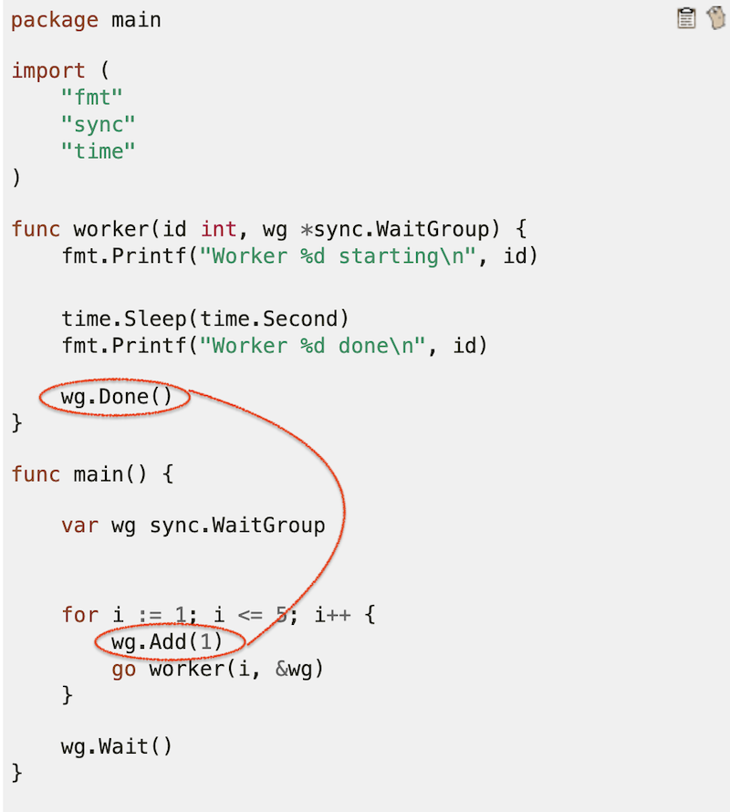

# Functional programming in Golang: continuation-passing style

During my one year experience of writing Golang programs I found
a beautiful pattern that makes error handling less painful.

The idea is to use higher-order functions: functions that
receives or accept functions.

## Built-in functional style approaches

### Higher-order functions

You can meet higher-order functions in standard libraries
like `context` (https://golang.org/pkg/context/#WithCancel)

```go
ctx, cancel := context.WithCancel(context.Background())
defer cancel() // cancel when we are finished
```

As you can see `context.WithCancel` return two values where
the second is a function which you can call to cancel the execution.


## CPS for resource management

Lifecycle of any resource is typically the same:
 * acquire resource (open a file)
 * use resource (read, write to file)
 * release resource (close file)

Typically, all these operations can also fail.

### File resource

Let's look at a typical Go function that work with file:
```go
func writeFile1(path, content string) error {
	file, err := os.OpenFile(path, os.O_CREATE | os.O_WRONLY, 0600)
	if err != nil {
		return err
	}
	defer file.Close()

	_, err = file.Write([]byte(content))
	if err != nil {
		return err
	}

	return err
}
```

Comparing this code with best practices we may notice that
there is a lot of unnecessary details: literally just
couple of lines are related to the task.

This interface of a file resource does not guide you on how to use it.
It does not force you to close resource properly.

So lets do some transformation - we will move out the code working
with file into a separate function which will be passed from outside:
```go
func writeFile1(path, content string) error {
    useFile := func (fd *os.File) error {
        return fd.Write([]byte(content))
    }
    flags := os.O_CREATE | os.O_WRONLY

    return WorkWithFile(path, flags, 0600, useFile)
}

type FileCallback = func (fd *os.File) error

func WorkWithFile(path string, flags, mode int, useFile FileCallback) error {
	file, err := os.OpenFile(path, flags, mode)
	if err != nil {
		return err
	}
	defer file.Close()
	
    err = useFile(file)
	if err != nil {
		return err
	}

	return err
}
```

What is really changed?
Now function `WorkWithFile` can be well-tested once and re-used as it
no longer has any specific code.

And our specific business code doesn't contain any resource-related
stuff at all.

This gives even much more profit when working with more elaborate resources.

This is something of the [Continuation-passing style](https://en.wikipedia.org/wiki/Continuation-passing_style) itself:

> In functional programming, continuation-passing style (CPS) is
> a style of programming in which control is passed explicitly
> in the form of a continuation

> A function written in continuation-passing style takes an extra argument:
> an explicit "continuation", i.e. a function of one argument.
> When the CPS function has computed its result value, it "returns" it
> by calling the continuation function with this value as the argument.

### Temporary files: suspend execution

With just additional little improvement we can do much better.
Let's not receive callback function, but return function which will receive
a callback function!
It may sound confusing, but we will see what a goldmine it is.

```go
func writeFile1(path, content string) error {
    useFile := func (fd *os.File) error {
        return fd.Write([]byte(content))
    }
    flags := os.O_CREATE | os.O_WRONLY

    // return WorkWithFile(path, flags, 0600, useFile)
    return WorkWithFile(path, flags, 0600)(useFile)
}

type FileCallback = func (fd *os.File) error
type FileResource = func(callback FileCallback) error 

func WorkWithFile(path string, flags, mode int) FileResource {
    return func(callback FileCallback) error {
        file, err := os.OpenFile(path, flags, mode)
        if err != nil {
            return err
        }
        defer file.Close()
        
        err = useFile(file)
        if err != nil {
            return err
        }
    
        return err
    }
}
```

Not so much changes, but now result of WorkWithFile can be re-used or passed around!
Something like:

```go
func main() {
    // file won't be opened here
    stateFileRes := WorkWithFile("./file.txt", os.O_CREATE | os.O_WRONLY, 0600)
    _ = myBusinessCode(stateFileRes)
}

func myBusinessCode(stateFileRes FileResource) error {
	return stateFileRes(func (fd *os.File) error {
       // use fd
    })
}
```

The most fit usage for this suspend is temporary resource
as they usually require to write down to much details:

```go
var TempFileResource FileResource =
	func(callback FileResourceCallback) error {
		file, err := ioutil.TempFile("", "")
		if err != nil {
			return err
		}
		defer file.Close()
		defer os.Remove(file.Name())

		return callback(file)
	}
```

Look how we re-used the same type, but implemented a different resource.
So we can now as our "business code" to work with temporary file without changing it!

```go
func main() {
    myBusinessCode(TempFileResource)
}
```

You can continue experiment with different implementation of FileResource.
For example, create a mock and test what happened to file after running
testing code.


### Automatic transaction commit/rollback
 
When it comes to transactions, error handling becomes a bit more complicated
because we handle "transaction resource" differently depending on the result
of our operation.

Typically we rollback transaction if some error occurred or commit it otherwise.
I will apply the same inversion as for file resource.
I won't bother you with naive version of code but will go right to the CPS-one.

```go
type TxCallback = func (tx *sql.Tx) error
type TxResource = func (TxCallback) error

func Transaction(db *sql.DB) TxResource {
    return func(callback func(tx *sql.Tx) error) error {
        tx, err := db.Begin()
        if err != nil {
            return err
        }
        err = callback(tx)
        if err != nil {
            _ = tx.Rollback()
            return err
        } else {
            return tx.Commit()
        }
    }
}
```

Looks pretty simple. As well as the usage of it:
```go
func myTransaction(db *sql.DB) (string, error) {
    var result string
    err := Transaction(db)(func(tx *sql.Tx) error {
    
        res1, err := tx.Exec("some first query")
        if err != nil {
            return err
        }
        
        res2, err := tx.Exec("some second query")
        if err != nil {
            return err
        }
        
        result = "some computed result"
        
        return err
    })
    return result, err
}
```

Note that inside of a transaction code you can just return error without
thinking about rollbacks.

### No more deadlock with sync.WaitGroup

There is also a bit more close to this article example of higher-order functions
in standard library.

You probably have seen this terrible [synchronization code](https://gobyexample.com/waitgroups):
```go
package main

import (
    "fmt"
    "sync"
    "time"
)

func worker(id int, wg *sync.WaitGroup) {
    fmt.Printf("Worker %d starting\n", id)
    time.Sleep(time.Second)
    fmt.Printf("Worker %d done\n", id)
    wg.Done()
}

func main() {
    var wg sync.WaitGroup
    for i := 1; i <= 5; i++ {
        wg.Add(1)
        go worker(i, &wg)
    }
    wg.Wait()
}
```

Why I think it is terrible?



Because operations of acquiring and releasing resource
(internal counter is something of resource here) are left around the code.
Acquiring is in orchestrator and releasing is in business code.
What is `worker` won't call `wg.Done`? Why it should even know about `wg`?
What if it will use wrong method?
Don't forget to pass `wg` as reference because it won't work as you expect
if passed as a value. Do you want to always remember that?

These worries are not unreasonable:


Using the CPS we can manage this and make it much simpler and safer to use:

```go
package main

import (
	"sync"
)

type SafeWaitGroup interface {
	Run(task func ())
	Wait()
}

type safeWaitGroupImpl struct {
	wg *sync.WaitGroup
}

func NewSafeWaitGroup() SafeWaitGroup {
	return &safeWaitGroupImpl{new(sync.WaitGroup)}
}

func (swg *safeWaitGroupImpl) Run(task func ()) {
	swg.wg.Add(1)
	go func() {
		task()
		swg.wg.Add(-1)
	}()
}

func (swg *safeWaitGroupImpl) Wait() {
	swg.wg.Wait()
}
```

As we can see incrementing and decrementing wait-counter is in the same place.
So it easier to understand why these operations are performed.
Once you have this tiny wrapper, you can forget about deadlock at all.
And user code becomes even simpler:

```go
package main

import (
    "fmt"
    "sync"
    "time"
)

func worker(id int) {
    fmt.Printf("Worker %d starting\n", id)
    time.Sleep(time.Second)
    fmt.Printf("Worker %d done\n", id)
}

func main() {
    swg := NewSafeWaitGroup()
    for i := 1; i <= 5; i++ {
        worker_i := i // capture i 
        swg.Run(func () {
          worker(worker_i)
        })
    }
    swg.Wait()
}
```

## Conclusion

As we can see CPS can help you to invert resource control to avoid
bloating your code with resource-handling details.

This will allow you to:
* test resource handling details independently of code using it
* enforce resource contract
* make your code much more readable and composable
* think about usage of more higher-order functions 

Hope you find this article helpful! Enjoy hacking!
